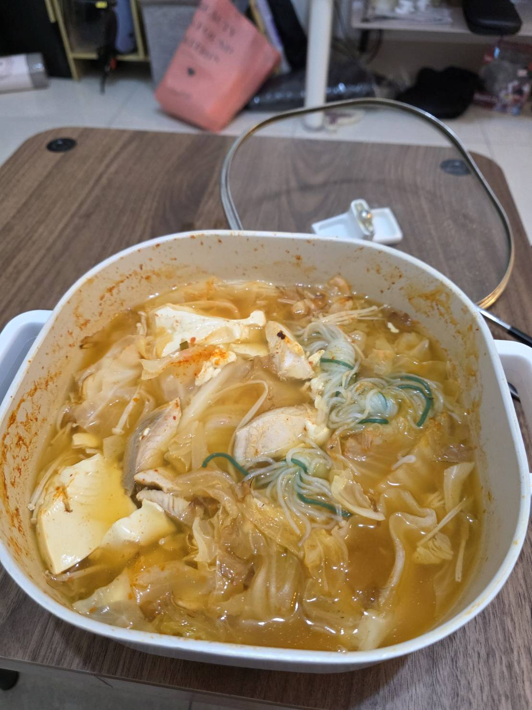

先放完成圖!

菜單是跟Gemini討論ㄉ，大概就是想要吃點不是優格跟雞胸肉的東西，最後Gemini給出了泡菜豆腐湯的建議
主要的材料大概就是泡菜、鯛魚片、蒟蒻條、豆腐、高麗菜、金針菇、柴魚片
高麗菜、金針菇、泡菜的份量大概都可以用個三次ㄅ，蒟蒻條兩盒分成四次煮，豆腐跟鯛魚片就是兩次
放柴魚片原本是怕煮出來沒味道，想說自製一個柴魚高湯XD，放下去意外的很香，然後煮完也有味道，不過確實我放的水太多，泡菜量可能也不夠ㄅ
最終煮出來的有點淡，不過喝起來還行，有一些泡菜的酸跟柴魚的香甜，
這樣吃完是有飽，不過好想吃鹹酥雞==

成本的話，好像也沒有多便宜，均分下來
高麗菜 $20 金針菇 $10 豆腐 $7 蒟蒻 $15 鯛魚 $60 柴魚 $20 泡菜 $40
這樣大概也要170 ==

哭阿還是有那裡可以改善的ㄇ
